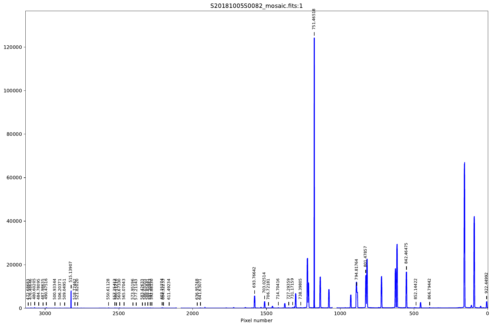
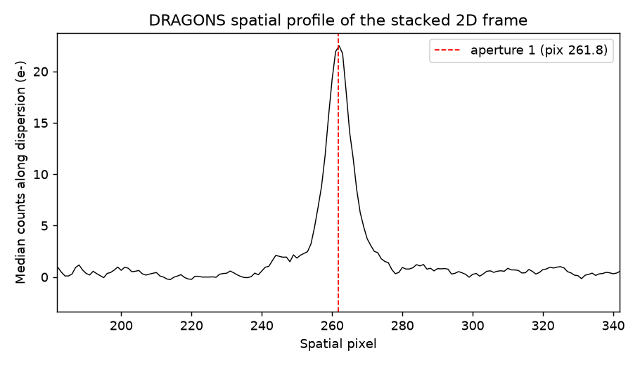
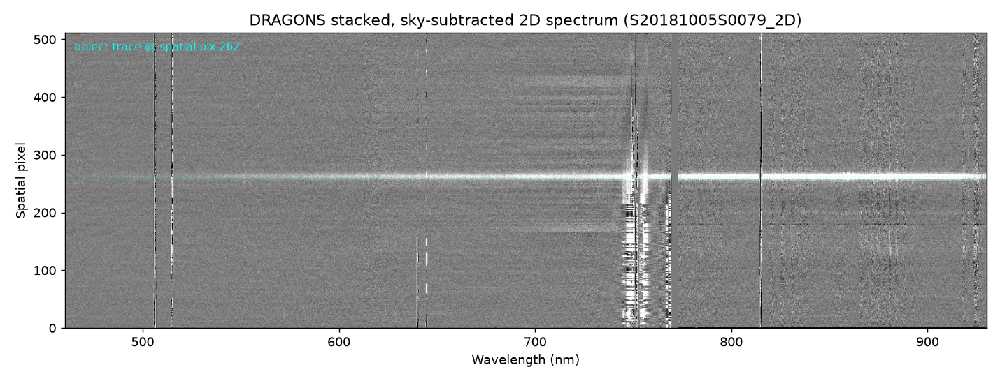
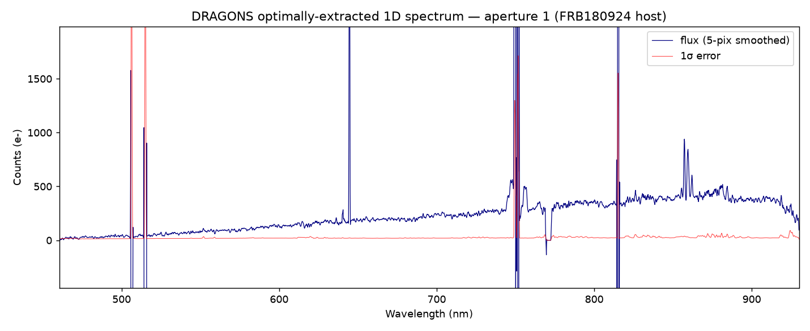

# DRAGONS Reduction of GMOS-S Data (FRB180924)

**Date:** 2026-06-26
**Reducer:** Claude (Claude Code)
**Pipeline:** [DRAGONS](https://dragons.readthedocs.io/) v4.2.2 (`reduce` / `astrodata` 4.2.2)
**Environment:** conda env `dragons_pypeit` (Python 3.12)
**Instrument:** Gemini-South GMOS (Hamamatsu CCDs), longslit
**Program:** GS-2018B-Q-133 (night 2018-10-05), target **FRB180924** host galaxy

> **Note on the prompt.** `reduce_dragons.md` task 1 reads "Reduce the Gemini data
> … *with PypeIt*", but this is a copy-paste artefact from the parallel
> `reduce_pypeit.md` prompt — the title, the named environment, and the linked
> ReadTheDocs page all refer to DRAGONS, and the PypeIt reduction was already
> done separately (`PypeIt_reduction.md`). This report therefore reduces the data
> **with DRAGONS** and, where useful, compares against the PypeIt run.
>
> **Note on installation.** The task says "Install DRAGONS with pip", but Gemini
> does **not** distribute the full DRAGONS suite on PyPI (the PyPI package named
> `dragons` is an unrelated namesake; only `astrodata` is published). DRAGONS is
> conda-only, so the environment was built with the supported conda command. See
> the Q&A entry logged in `reduce_dragons.md`.

---

## 1. The data

The eight frames in `/mnt/tank/Astronomy/PypeIt/DRAGONS/Raw` are the same set
used for the PypeIt reduction. All eight verified against `md5sums.txt` and were
decompressed into `/mnt/tank/Astronomy/PypeIt/DRAGONS/DRAGONS/raw`.

| File | DRAGONS tags | Object | Exp (s) | Role |
|------|--------------|--------|--------:|------|
| S20181005S0079 | (GMOS)(SPECT)(LS) | FRB180924 | 700 | science |
| S20181005S0080 | (GMOS)(SPECT)(LS) | FRB180924 | 700 | science |
| S20181005S0085 | (GMOS)(SPECT)(LS) | FRB180924 | 700 | science |
| S20181005S0086 | (GMOS)(SPECT)(LS) | FRB180924 | 700 | science |
| S20181005S0081 | (FLAT)(GCALFLAT) | GCALflat | 1 | flat |
| S20181005S0084 | (FLAT)(GCALFLAT) | GCALflat | 1 | flat |
| S20181005S0082 | (ARC) | CuAr | 16 | arc |
| S20181005S0083 | (ARC) | CuAr | 16 | arc |

`typewalk` confirms these are GMOS-S **longslit spectra** ((GMOS)(LS)(SPECT)), not
imaging — so the GMOS *longslit* tutorial recipes apply, not the GMOS imaging
tutorial that the prompt happens to link.

**Instrument configuration:** grating R400+_G5325, central wavelength 700 nm,
order-sort filter GG455, 1.0″ longslit, **2×2 binning**, ROI **Central
Spectrum**, Normal read mode.

**Two gaps in the calibration set (identical to the PypeIt run):**

- **No bias frames.** Unlike PypeIt — which can drop bias subtraction and rely
  on the overscan — the DRAGONS GMOS-LS recipes *require* a processed bias
  (`biasCorrect` raises `CalibrationNotFoundError` with overscan only). I
  therefore downloaded the **5 associated bias frames from the same night**
  (S20181005S0382–0386; GMOS-S, 2×2, Central Spectrum, Normal read) from the
  Gemini public archive — exactly what the DRAGONS tutorial does. This is the
  only deviation from the literal "data in Raw"; all 8 original frames are
  unchanged.
- **No standard star.** No spectrophotometric standard exists in the dataset, so
  **no flux calibration** was possible. The spectra are in detector electrons,
  not physical flux units. (Same limitation as the PypeIt reduction.)

There is also **no bad-pixel mask** — DRAGONS reported "No BPMs found … and none
supplied by the user", so the reduction ran without a static BPM.

---

## 2. Steps taken

All commands were run from `/mnt/tank/Astronomy/PypeIt/DRAGONS/DRAGONS` in the
`dragons_pypeit` env.

1. **Create the environment (conda; pip not available for DRAGONS)**
   ```bash
   conda create -y -n dragons_pypeit -c conda-forge \
       -c http://astroconda.gemini.edu/public python=3.12 dragons
   ```

2. **Configure the local calibration service** (`~/.dragons/dragonsrc` points the
   database at the working dir):
   ```bash
   caldb init
   ```

3. **Augment with archive biases** (see §1) and build the input lists:
   ```bash
   dataselect raw/*.fits --tags BIAS                       -o biases.lis
   dataselect raw/*.fits --tags FLAT                       -o flats.lis
   dataselect raw/*.fits --tags ARC                        -o arcs.lis
   dataselect raw/*.fits --xtags CAL --expr='object=="FRB180924"' -o sci.lis
   ```

4. **Reduce the calibrations** (each `reduce` stores its product in `caldb`):
   ```bash
   reduce @biases.lis     # -> processed_bias  (5 biases, mean + varclip)
   reduce @flats.lis      # -> 2 processed_flats (GMOS-LS "NoStack" recipe)
   reduce @arcs.lis       # -> 2 processed_arcs (wavelength + distortion model)
   ```

5. **Reduce the science.** The stock `reduceScience` recipe ends with
   `fluxCalibrate`, which aborts here because there is no processed standard. I
   used a custom recipe (`myrecipes.reduceScienceNoFlux`) that is **byte-for-byte
   the stock recipe with the single `fluxCalibrate()` line removed** — no other
   parameters were changed:
   ```bash
   reduce @sci.lis -r myrecipes.reduceScienceNoFlux
   ```
   This ran `prepare → addDQ → addVAR → overscanCorrect → biasCorrect →
   ADUToElectrons → attachWavelengthSolution → flatCorrect → QECorrect →
   flagCosmicRays → distortionCorrect → findApertures → skyCorrectFromSlit →
   adjustWCSToReference → resampleToCommonFrame → scaleCountsToReference →
   stackFrames → findApertures → traceApertures → extractSpectra`, finishing with
   **"reduce completed successfully."**

**Products** (`S20181005S0079` is the first science file, used to name the stack):

- `S20181005S0079_2D.fits` — stacked, sky-subtracted, wavelength- &
  distortion-corrected 2-D spectrum.
- `S20181005S0079_1D.fits` — extracted 1-D spectra (one FITS extension per
  aperture), in electrons.

---

## 3. Quality of the reduction

### 3.1 Wavelength calibration (CuAr arc)

DRAGONS's **standard, non-interactive** wavelength fit (reported verbatim from
its log) for the two arcs:

| Arc | Lines matched | Forward fit RMS | Inverse model RMS | Distortion (2-D tilt) RMS |
|-----|---------------|-----------------|-------------------|---------------------------|
| S0082 | 43 / 79 | 0.790 nm | 0.016 px | 0.121 / 0.120 px |
| S0083 | 37 / 74 | 0.851 nm | 0.116 px | 0.148 / 0.148 px |

- The **2-D distortion (tilt) model is sub-pixel** (~0.12–0.15 px), comparable to
  PypeIt's tilt RMS (0.034 px).
- The **forward (pixel→wavelength) fit RMS is large** (~0.79–0.85 nm ≈ 8 Å,
  i.e. ~5 px), and noticeably worse than PypeIt's automatic solution
  (0.110 px ≈ 0.16 Å). DRAGONS matched only ~half of the detected CuAr lines.
  These are the pipeline's **default automatic numbers** — DRAGONS recommends its
  *interactive* wavelength fitter (`-p interactive=True`) to improve the GMOS-LS
  solution, which was **not** used here (the run is the standard out-of-the-box
  output, as requested).
- Final dispersion ≈ **1.45 Å/pix**; usable coverage **≈ 4605–9300 Å**
  (460–930 nm) — essentially identical to PypeIt.



*DRAGONS `determineWavelthSolution` QA for the CuAr arc S0082: identified CuAr
lines (labelled, in nm) over the full detector. Several of the strongest red
lines were not matched, consistent with the ~half-of-lines matched statistic.*

### 3.2 Object detection, tracing & extraction

`findApertures` detected **6 apertures** on the stacked frame. Only **aperture 1
is real** — the others are low-S/N noise/cosmic-ray features (median S/N < 1.1):

| Aperture | spatial pix (c0) | median flux (e⁻) | median S/N |
|----------|-----------------:|-----------------:|-----------:|
| **1 (target)** | **261.8** | **210.9** | **9.64** |
| 2 | 167.2 | 22.8 | 0.98 |
| 3 | 422.4 | 15.8 | 0.77 |
| 4 | 394.9 | 8.1 | 0.58 |
| 5 | 196.5 | 9.0 | 0.44 |
| 6 | 131.4 | 26.8 | 1.03 |



*Median-collapsed spatial profile of the stacked 2-D frame. A single clear peak
at spatial pixel ≈ 262 (red dashed) is the FRB 180924 host; the surrounding
apertures sit in the noise.*

The four science frames were registered with sub-pixel offsets
(−0.04 to −0.30 px) and stacked, so the extracted spectrum is the equivalent of a
4×700 s = 2800 s integration.

### 3.3 Sky subtraction (2D)



*Stacked, sky-subtracted 2-D spectrum (ZScale). The object trace is the
horizontal band at spatial pixel ≈ 262 (cyan dotted). The background is flat and
near zero between sky lines; the vertical streaks are residuals at the strongest
night-sky emission lines — the expected behaviour of slit sky subtraction.*

### 3.4 Extracted 1D spectrum



*Optimally-extracted 1-D spectrum of aperture 1 (5-pixel smoothed, blue) with its
1σ error (red). The continuum is recovered from ~460 to ~930 nm with **median S/N
≈ 9.6** in the stack. The broad dip near 760 nm is the telluric O₂ A-band;
structure near 855–880 nm is in the same region where the PypeIt reduction saw
an emission feature (plausibly redshifted Hα of the host). The sharp narrow
spikes are residuals at bright sky lines / cosmic rays, not real features.*

---

## 4. Comparison with the PypeIt reduction

| Quantity | DRAGONS (this run) | PypeIt (`PypeIt_reduction.md`) |
|----------|--------------------|--------------------------------|
| Bias handling | Required; used 5 archive biases | Overscan only (no bias) |
| Object spatial position | pixel 261.8 | pixel ≈ 262.8 |
| Wavelength coverage | 4605–9300 Å | 4600–9300 Å |
| Dispersion | ~1.45 Å/pix | ~1.50 Å/pix |
| Wavelength-tilt / distortion RMS | 0.12–0.15 px | 0.034 px |
| Wavelength forward-fit RMS (default) | ~0.79–0.85 nm (8 Å) | 0.110 px (0.16 Å) |
| Combined median S/N | ≈ 9.6 (4-frame stack) | ≈ 10 (4-frame coadd) |
| Flux calibration | None (no standard) | None (no standard) |

**Bottom line:** the two pipelines agree closely on the things that matter most
for this faint target — the object is found at the same spatial position, over the
same wavelength range, with the same combined S/N (~10). The most notable
difference is the **default automatic wavelength solution**, where PypeIt's
out-of-the-box fit (0.16 Å) is tighter than DRAGONS's non-interactive fit (~8 Å
forward RMS); DRAGONS's own recommendation for GMOS-LS is to refine this with its
interactive fitter. A second structural difference is that DRAGONS *requires*
bias frames (here pulled from the archive) whereas PypeIt completed with overscan
alone.

---

## 5. Caveats & possible next steps

- **No flux calibration** (no standard star) — spectra are in electrons. Obtain a
  spectrophotometric standard in this configuration and add `fluxCalibrate` back
  into the recipe.
- **Default wavelength solution.** Per request this is the standard automatic
  output; the GMOS-LS forward RMS would benefit from DRAGONS's interactive
  wavelength fit (`reduce @arcs.lis -p interactive=True`).
- **No BPM** was available/applied; supplying a GMOS-S BPM would improve
  bad-pixel/cosmic-ray flagging.
- **Bias provenance.** The biases come from the same night but are not part of the
  delivered dataset; results would be identical to a "calibrations-included"
  download from the archive.

---

## 6. Reproduce

```bash
conda create -y -n dragons_pypeit -c conda-forge \
    -c http://astroconda.gemini.edu/public python=3.12 dragons
conda activate dragons_pypeit
cd /mnt/tank/Astronomy/PypeIt/DRAGONS/DRAGONS      # raw/ holds the 8 frames + 5 archive biases
caldb init
dataselect raw/*.fits --tags BIAS -o biases.lis
dataselect raw/*.fits --tags FLAT -o flats.lis
dataselect raw/*.fits --tags ARC  -o arcs.lis
dataselect raw/*.fits --xtags CAL --expr='object=="FRB180924"' -o sci.lis
reduce @biases.lis
reduce @flats.lis
reduce @arcs.lis
reduce @sci.lis -r myrecipes.reduceScienceNoFlux   # stock reduceScience minus fluxCalibrate
```

Figures in `Reports/figs/` (`fig_dragons_*.png`) were generated from the `_1D` /
`_2D` products and the arc QA PDF with `make_figs.py` in the working directory.
The 5 archive bias frames were selected/downloaded from
`https://archive.gemini.edu` (GMOS-S, 2018-10-05, 2×2, Central Spectrum).
