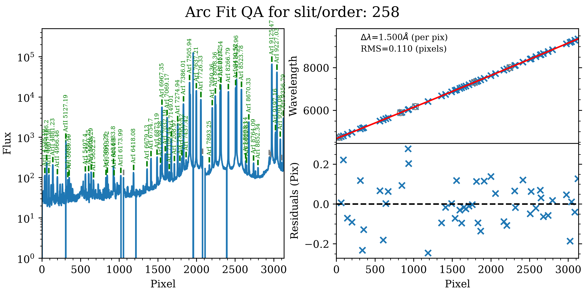
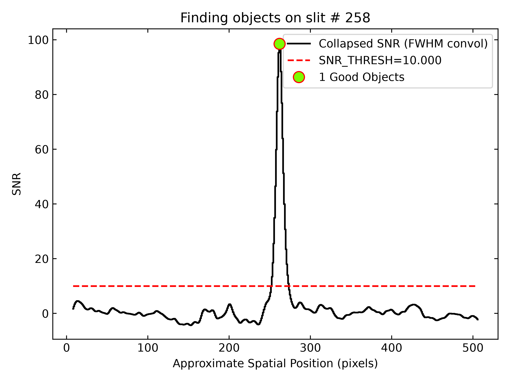
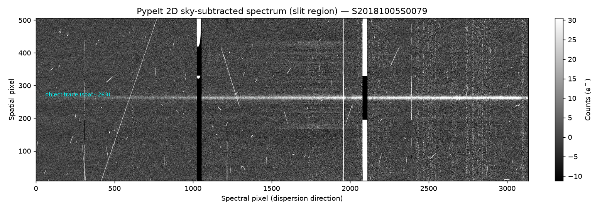
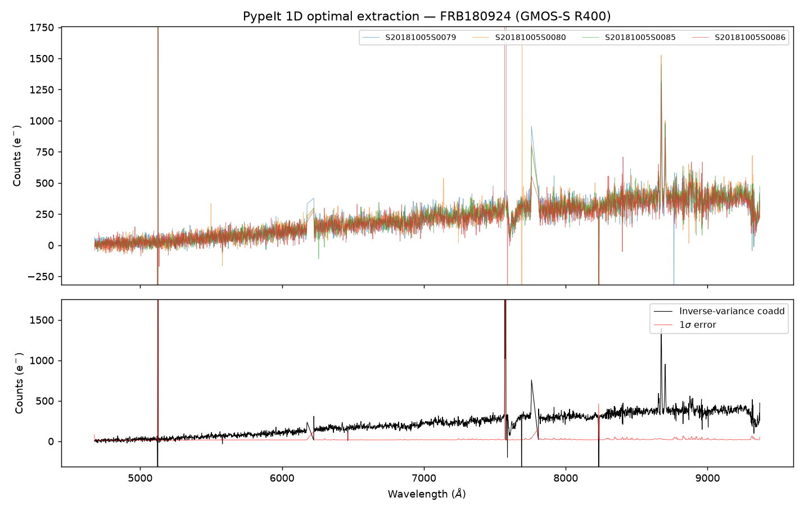

# PypeIt Reduction of GMOS-S Data (FRB180924)

**Date:** 2026-06-26
**Reducer:** Claude (Claude Code)
**Pipeline:** [PypeIt](https://pypeit.readthedocs.io/) v2.0.1 (installed via `pip`)
**Environment:** conda env `pypeit_dragons` (Python 3.12)
**Instrument:** Gemini-South GMOS (Hamamatsu CCDs), longslit
**Program:** GS-2018B-Q-133 (night 2018-10-05), target **FRB180924** host galaxy

---

## 1. The data

Raw frames live in `/mnt/tank/Astronomy/PypeIt/DRAGONS/Raw` (downloaded from the
Gemini archive, all 8 files verified against `md5sums.txt`). They were
decompressed from `.fits.bz2` into a working directory
`/mnt/tank/Astronomy/PypeIt/DRAGONS/PypeIt/raw`.

| File | Type | Object | Exp (s) | Notes |
|------|------|--------|--------:|-------|
| S20181005S0079 | science | FRB180924 | 700 | |
| S20181005S0080 | science | FRB180924 | 700 | |
| S20181005S0085 | science | FRB180924 | 700 | |
| S20181005S0086 | science | FRB180924 | 700 | |
| S20181005S0081 | flat (GCAL) | GCALflat | 1 | |
| S20181005S0084 | flat (GCAL) | GCALflat | 1 | |
| S20181005S0082 | arc (CuAr) | CuAr | 16 | |
| S20181005S0083 | arc (CuAr) | CuAr | 16 | |

**Instrument configuration (single setup "A"):** grating R400+_G5325, central
wavelength 700 nm, order-sort filter GG455, 1.0″ longslit, **2×2 binning**.

**Two notable gaps in the calibration set:**

- **No bias frames.** GMOS bias level is handled with the serial **overscan**
  region instead (see §2).
- **No standard star.** Therefore **no flux calibration / sensitivity
  function** was produced; the extracted spectra are in detector counts
  (electrons), not physical flux units.

---

## 2. Steps taken

All commands were run from
`/mnt/tank/Astronomy/PypeIt/DRAGONS/PypeIt` inside the `pypeit_dragons` env.

1. **Create + populate the environment**
   ```bash
   conda create -y -n pypeit_dragons python=3.12
   pip install pypeit            # -> PypeIt 2.0.1 and dependencies
   ```

2. **Setup / frame typing**
   ```bash
   pypeit_setup -s gemini_gmos_south_ham -r raw/ -c A
   ```
   PypeIt found 8 files, identified **1 unique configuration**, and typed every
   frame correctly with no manual intervention (4 `science`, 2
   `pixelflat,illumflat,trace`, 2 `arc,tilt`). This produced
   `gemini_gmos_south_ham_A/gemini_gmos_south_ham_A.pypeit`.

3. **Handle the missing biases.** The first `run_pypeit` attempt aborted with:
   ```
   PypeItError: No frames of type=bias provided for the *use_biasimage* processing step.
   ```
   The fix was to switch off bias-image subtraction (GMOS then uses the
   overscan) by adding to the `.pypeit` file:
   ```ini
   [baseprocess]
       use_biasimage = False
   ```

4. **Run the reduction**
   ```bash
   run_pypeit gemini_gmos_south_ham_A.pypeit -o
   ```
   This built the calibrations (overscan, trace/illumination/pixel flats,
   wavelength solution from CuAr, wavelength tilts), then for each of the 4
   science frames performed: overscan subtraction, flat-fielding, the 3-CCD
   **mosaic** (`MSC01`), global + local sky subtraction, automatic object
   finding, optimal + boxcar extraction, and local spectral-flexure and
   heliocentric corrections. The run finished with **exit code 0** and no
   errors.

**Products** (`gemini_gmos_south_ham_A/Science/`): one `spec2d_*.fits` and one
`spec1d_*.fits` per science frame, plus QA PNGs/HTML under `QA/`.

---

## 3. Quality of the reduction

### 3.1 Wavelength calibration (CuAr arc)

The arc solution is excellent and consistent across the night:

- **Final fit RMS = 0.110 pixels** (≈ 0.16 Å at 1.500 Å/pix) — well below the
  ~0.3 px that would flag a problem.
- **Dispersion ≈ 1.500 Å/pix**; usable coverage **≈ 4600–9300 Å**.
- **Wavelength-tilt fit RMS = 0.034 pixels** (RMS/FWHM ≈ 0.007), i.e. the 2D
  tilt model is sub-pixel everywhere.



*Arc 1D-fit QA: many CuAr lines identified across the full detector (left); the
fit residuals (lower right) scatter within ±0.25 px about zero with RMS 0.110
px.*

### 3.2 Object detection, tracing & extraction

A single object is cleanly detected on the science slit (slit 258), the same
target in all four exposures at the same spatial position:

| Frame | spat_pixpos | FWHM (pix) | per-pixel S/N | wv_rms (pix) |
|-------|------------:|-----------:|--------------:|-------------:|
| S0079 | 262.8 | 1.15 | 5.38 | 0.110 |
| S0080 | 262.7 | 1.19 | 5.47 | 0.110 |
| S0085 | 263.1 | 1.16 | 5.02 | 0.110 |
| S0086 | 263.1 | 1.36 | 4.67 | 0.110 |

The collapsed-S/N profile peaks sharply (~98) at the object position, far above
the detection threshold, with no spurious sources:



The per-exposure S/N (~5) is modest, as expected for a faint FRB host galaxy in
a single 700 s exposure. The four positions agree to ≈ 0.4 px, confirming a
stable trace and good astrometric/flexure behaviour.

### 3.3 Sky subtraction (2D)



*Sky-subtracted 2D mosaic of the first science frame (illuminated slit region).
The faint horizontal object trace sits at spatial pixel ≈ 263 (cyan dotted
line). The two black vertical bands are the GMOS inter-CCD gaps; the bright
vertical streaks are residuals at the strongest night-sky emission lines.
Away from those lines the background is flat and centred on zero — the global +
local sky model performed well.*

### 3.4 Combined 1D spectrum



*Top: the four individual optimally-extracted spectra (counts vs. wavelength).
Bottom: a simple inverse-variance coadd (black) with its 1σ error (red).*

Combining the four exposures roughly doubles the S/N (median **S/N ≈ 10** in the
coadd, vs ≈ 5 per frame — consistent with the √4 expectation). The continuum is
well-recovered from ~4600 Å to ~9300 Å, and there is a clear **emission line
near ~8650 Å**, plausibly Hα at the host-galaxy redshift z ≈ 0.32
(the well-studied FRB 180924 host). The few sharp spikes near the chip gaps and
the strongest sky lines are residual artefacts, not real features.

---

## 4. Caveats & possible next steps

- **No flux calibration.** No standard star was in the dataset, so spectra are
  in counts. To flux-calibrate, obtain a spectrophotometric standard in the same
  configuration and run `pypeit_sensfunc` + `pypeit_flux_calib`.
- **Formal coadd.** The combined spectrum here is a quick inverse-variance
  average for QA. For science use, run PypeIt's proper coadd
  (`pypeit_coadd_1dspec`, optionally `pypeit_coadd_2dspec`), which handles the
  per-pixel masking and weighting correctly.
- **Bias.** Overscan was used in place of bias frames; this is standard for GMOS
  and the flat/sky behaviour shows no obvious bias-structure problems, but a
  bias set could be added if available.

---

## 5. Reproduce

```bash
conda activate pypeit_dragons          # PypeIt 2.0.1, Python 3.12
cd /mnt/tank/Astronomy/PypeIt/DRAGONS/PypeIt
# raw/ holds the 8 decompressed GMOS-S frames
pypeit_setup -s gemini_gmos_south_ham -r raw/ -c A
# add `[baseprocess]\n    use_biasimage = False` to the .pypeit file
run_pypeit gemini_gmos_south_ham_A/gemini_gmos_south_ham_A.pypeit -o
```

Figures in `Reports/figs/` were generated from the `spec1d`/`spec2d` products
with the helper scripts `make_figs.py` and `make_fig2d.py` (in the working
directory).
